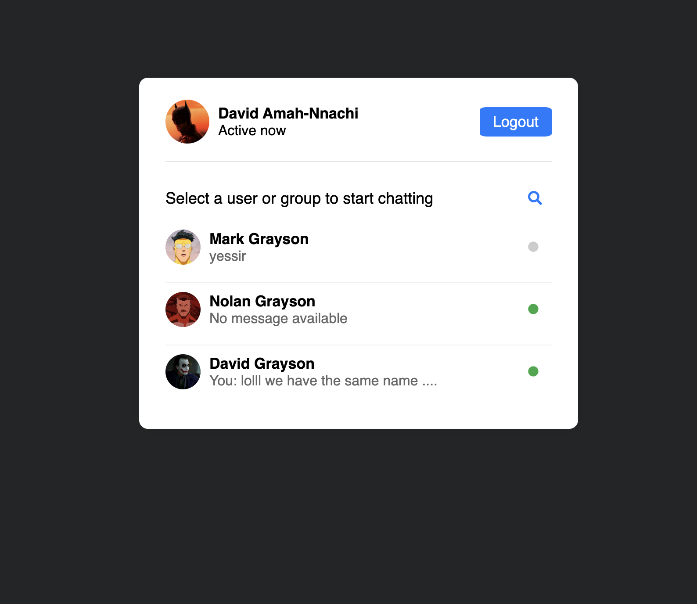

# Realtime Chat Application
In this project you can create an account, login in and message other users, it shows which users and their status (if they are online or not), you are able to logout

# Features
* Real-time messaging
* User authentication

# Prequisites
* Programming IDE
* XAMMP

# Tech Stack
* Frontend: HTML, CSS, JavaScript
* Backend: HTML, CSS, JavaScript, React.js
* ServerSide: PHP
* Database: MySQL

# Demo Sign In

# Demo Logged In

# Youtube Demo
https://youtu.be/e22gL_1HDQQ

# Helpful tips
If the "move_uploaded_file()" does not work, you can try changing the permission of the folder

This command "sudo chmod -R 777 ." worked for me